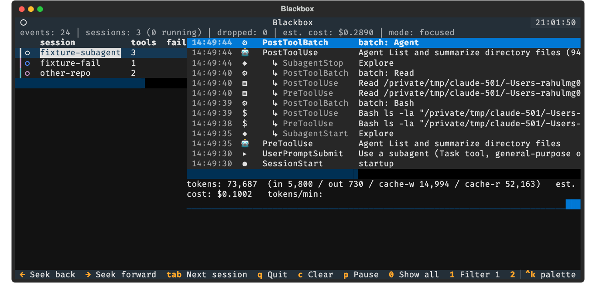

# Blackbox

A flight recorder + live cockpit TUI for Claude Code sessions.

Claude Code's activity — prompts, tool calls, file edits, subagents, token
spend — normally only exists as scrolling chat text, gone the moment the
terminal closes. Blackbox fixes that. It's two cooperating pieces:

- **Recorder** — a tiny stdlib-only hook script that Claude Code calls on
  every lifecycle event (prompt submitted, tool about to run, tool
  finished, session ended, subagent spawned, ...). Each event is appended
  as one JSON line to a durable per-session log on disk.
- **Console** — a Textual TUI that tails those logs and renders them live:
  a colored multi-session firehose, a per-session cockpit view with tool
  durations and token/cost tracking, a tiled wall of every active session,
  and full replay of any past session at up to max speed.

Recording is always on, for every Claude Code session on the machine, with
zero effort after a one-time install. If the console isn't running, events
still land in the log — the console just catches up on next launch, so
nothing is ever lost.



## Quickstart

```bash
pipx install blackbox-cc     # or: pip install blackbox-cc
blackbox install             # registers the recorder as a Claude Code hook
blackbox                     # launch the live cockpit
```

That's it — `blackbox install` is idempotent and additive (it merges into
`~/.claude/settings.json`, backing the file up first, and never touches
hooks it didn't add). Run `blackbox doctor` any time to check that recording
is actually working.

## Usage

| Command | What it does |
|---|---|
| `blackbox` | Launch the live cockpit (default: focused mode) |
| `blackbox install` / `uninstall` | Register / remove the recorder hook |
| `blackbox doctor` | Check that recording is healthy |
| `blackbox replay --session <id>` | Replay a past session |
| `blackbox replay` | Browse past sessions, then replay one |
| `blackbox export <session>` | Export a session to a self-contained HTML timeline |

### View modes

| Mode | What you see |
|---|---|
| **Focused** (default) | Sidebar of all sessions (name, liveness, tool/fail counts) on the left; the selected session's full timeline in the middle; a stats bar (tokens, cost, tokens/min) at the bottom. |
| **Firehose** | Every session's events interleaved into one chronological, color-coded scrolling log — the fastest way to watch everything happening on the machine at once. |
| **Wall** | A tiled grid, one pane per live session (up to 4, with a "+N more" strip beyond that) — good for keeping an eye on several sessions at a glance. |
| **Replay** | The same UI fed from a past session's log instead of live data, with speed control and seeking — watch any session like game film. |

### Other things you can do

- **Install/uninstall the recorder** without hand-editing config — `blackbox install` merges hook entries into `~/.claude/settings.json` (backing the file up first) and never touches hooks it didn't add; `blackbox uninstall` reverses it cleanly.
- **Check recording health** any time with `blackbox doctor` — confirms the hook is registered, the courier script runs, the log directory is writable, and reports how long ago the last event landed.
- **Drill into any event** — `enter` on a timeline row opens the full pretty-printed payload (tool input/output, prompt text, etc.).
- **Read the actual conversation** — `t` opens the chat transcript for the selected session, reconstructed from Claude Code's own transcript file.
- **Search and filter** — `/` searches the current view (event text, file paths, commands); `e` shows errors only; number keys filter the firehose to a single session.
- **Track spend** — per-turn and per-session token/cost estimates, backed by an editable pricing table in `~/.blackbox/config.toml`.
- **Get notified** — optional desktop notifications on long-running tool completion or `Notification` events, config-gated in `config.toml`.
- **Export a session** — `blackbox export <session>` produces a single self-contained HTML timeline you can send to someone without them installing anything.
- **Jump around fast** — `ctrl+k` opens a command palette to jump to a session, filter by event type, or change theme, without memorizing every key.
- **Toggle light/dark theme** — `d`, for whichever terminal background you're on.

### Keybindings

| Key | Action |
|---|---|
| `s` / `f` / `w` | Switch mode: focused / firehose / wall |
| `tab` | Cycle the selected session (focused mode) |
| `g` | Toggle focus-follow (auto-jump to the most recently active session) |
| `enter` | Open the detail view for the selected row (focused mode) |
| `t` | Open the chat transcript for the selected session |
| `/` | Search the current view |
| `e` | Errors-only filter |
| `d` | Toggle dark/light theme |
| `ctrl+k` | Command palette (jump to session, filter by event type, full theme picker, ...) |
| `p` | Pause/resume the live view |
| `1`-`9` / `0` | Filter the firehose to one session / clear the filter |
| `end` | Resume auto-scroll after scrolling up |
| `space` | Pause/resume replay (replay mode only) |
| `←` / `→` | Seek back/forward (replay mode only) |
| `]` / `[` | Replay speed up/down: 1x → 5x → 20x → max |
| `q` | Quit |

## How it works

A tiny stdlib-only script (`courier/emit.py`) is registered with Claude
Code's hooks system. Every lifecycle event — prompt submitted, tool about to
run, tool finished, session ended, subagent spawned, ... — gets appended as
one JSON line to `~/.blackbox/sessions/<session_id>/main.jsonl` (or
`agent-<agent_id>.jsonl` for a subagent). The console tails that directory
tree and renders the same data live; replay just reads it from the start
instead.

See `blackbox-design-doc.md` for the full design rationale, including why
recording is file-per-actor rather than one shared log, how concurrent
writes stay safe, and how tool-call pairing handles the async hook model.

## Development

```bash
uv sync --group dev
uv run blackbox --version
uv run pytest
uv run ruff check .
```

Config (pricing table, desktop notifications) lives in
`~/.blackbox/config.toml`, created with sensible defaults on first run of
the console — edit it directly.

## Publishing to PyPI

This is for maintainers cutting a release, not for end users (who just run
`pip install blackbox-cc`). The package builds with `hatchling`, driven by
`pyproject.toml`, and ships via [uv](https://docs.astral.sh/uv/).

1. **Bump the version** in `pyproject.toml` (`[project] version = "..."`,
   [SemVer](https://semver.org/)) and commit it.

2. **Build the distribution**:

   ```bash
   rm -rf dist/
   uv build
   ```

   This produces a wheel and an sdist in `dist/`. Note the
   `[tool.hatch.build.targets.wheel.force-include]` entry in
   `pyproject.toml` — it copies `courier/emit.py` into
   `blackbox/courier/emit.py` inside the wheel, since the courier script
   lives outside `src/blackbox/` in the repo but still needs to ship
   inside the installed package. If you ever move the courier, update that
   mapping too.

3. **Verify the build** before uploading anything:

   ```bash
   # sanity-check the courier is actually bundled
   python3 -c "
   import zipfile, glob
   wheel = glob.glob('dist/*.whl')[0]
   with zipfile.ZipFile(wheel) as z:
       assert 'blackbox/courier/emit.py' in z.namelist()
   print('OK:', wheel)
   "

   # install into a throwaway venv and smoke-test the CLI
   uv run --with dist/*.whl --no-project -- blackbox --version
   ```

   (The CI workflow in `.github/workflows/ci.yml` already runs the
   bundling check on every push — this step is a local double-check
   before a release.)

4. **(Recommended) do a dry run on TestPyPI first**, especially for the
   first-ever publish or after touching packaging config:

   ```bash
   uv publish --index testpypi --token <your-testpypi-token>
   pip install --index-url https://test.pypi.org/simple/ blackbox-cc
   ```

   `testpypi` needs a matching `[[tool.uv.index]]` entry in
   `pyproject.toml`, or pass `--publish-url https://test.pypi.org/legacy/`
   directly.

5. **Publish to PyPI**:

   ```bash
   uv publish --token <your-pypi-api-token>
   ```

   Generate the token from [pypi.org](https://pypi.org) → Account settings
   → API tokens (scope it to the `blackbox-cc` project once the first
   release exists). Set it as `UV_PUBLISH_TOKEN` in the environment to
   avoid passing it on the command line, or store it in
   `~/.config/uv/uv.toml`.

6. **Tag the release** in git and push the tag:

   ```bash
   git tag v0.1.0
   git push origin v0.1.0
   ```

Once published, anyone can install it with any of:

```bash
pipx install blackbox-cc      # isolated, recommended for a CLI tool
uv tool install blackbox-cc   # uv's equivalent of pipx
pip install blackbox-cc       # into whatever environment is active
```

**Automating this**: if you'd rather not run `uv publish` by hand each
time, PyPI supports [Trusted Publishing](https://docs.pypi.org/trusted-publishers/)
via GitHub Actions (OIDC, no stored token) — add a `release.yml` workflow
triggered on tag push that runs `uv build` then `uv publish`, and register
the repo as a trusted publisher in the PyPI project settings. Not set up
in this repo yet.
